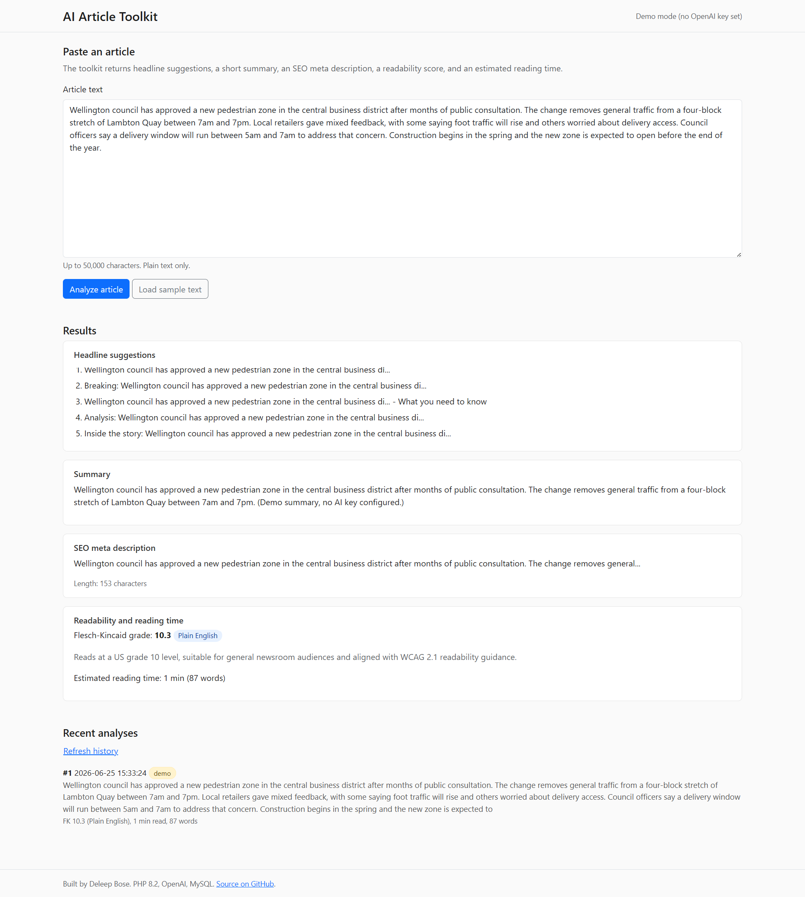

# AI Article Toolkit

A PHP toolkit for newsroom and content workflows. Paste an article, get AI-generated headline suggestions, a short summary, an SEO meta description, a Flesch-Kincaid readability score, and a reading time estimate. Results are persisted to MySQL so editors can review prior runs.

Built as a portfolio piece to combine four things I work with on a daily basis: PHP backend engineering, REST APIs, OpenAI integration, and accessible front-end delivery.

## Features

- AI headline generation via OpenAI Chat Completions
- AI summary generation (2 to 3 sentences)
- SEO meta description generation (under 160 characters)
- Flesch-Kincaid readability score with a plain-English accessibility band
- Reading time estimate based on 230 words per minute
- Analysis history stored in MySQL, browsable from the UI
- Demo mode when no OpenAI API key is configured, so reviewers can run the app without credentials
- WCAG 2.1 AA accessible interface, semantic HTML, keyboard navigation, visible focus states, ARIA live region for async results
- REST API endpoints, parameterised SQL across the data layer
- Dockerised local environment, PHPUnit test suite, GitHub Actions CI

## Tech stack

PHP 8.2, MySQL 8, Composer, Bootstrap 5, vanilla JavaScript and the Fetch API on the front end, PHPUnit 10 for tests, GitHub Actions for CI, Docker and docker-compose for the local environment.

No PHP framework. The structure borrows the controller and service separation I have used across CodeIgniter and CakePHP projects, kept thin so the code stays readable in a single sitting.

## Screenshot



The screenshot shows the app analyzing a sample article in demo mode, with headline suggestions, summary, SEO meta description, Flesch-Kincaid readability score, and reading time estimate.

## Architecture

```
Browser (Bootstrap 5 + vanilla JS)
    |
    | fetch POST /api/analyze
    v
public/index.php  ---->  Api\Router
                              |
                              v
                    Services
                    +-- HeadlineGenerator  --> OpenAiClient --> OpenAI API
                    +-- SummaryGenerator   --> OpenAiClient --> OpenAI API
                    +-- MetaDescriptionGenerator --> OpenAiClient --> OpenAI API
                    +-- ReadabilityAnalyzer (no external calls)
                              |
                              v
                    Database\AnalysisRepository  -->  MySQL
```

The readability analyzer is pure PHP and has no network dependency, which is why the test suite covers it in detail without mocking HTTP.

## Running locally with Docker

```bash
git clone https://github.com/deleepbose/ai-article-toolkit.git
cd ai-article-toolkit
cp .env.example .env
# Optional: set OPENAI_API_KEY in .env to enable live AI calls
docker-compose up --build
```

The app will be available at `http://localhost:8080`. MySQL is exposed on port 3307 to avoid clashing with a host install.

## Running locally without Docker

Requires PHP 8.2+, Composer, and a MySQL 8 instance.

```bash
composer install
cp .env.example .env
mysql -u root -p < sql/schema.sql
php -S localhost:8080 -t public
```

## Running locally with XAMPP (Windows)

1. Drop the project into `xampp/htdocs/ai-article-toolkit/`.
2. Run `composer install` from the project root.
3. Start MySQL from the XAMPP Control Panel and import `sql/schema.sql` through phpMyAdmin.
4. Copy `.env.example` to `.env` and set `DB_HOST=127.0.0.1`, `DB_USER=root`, `DB_PASS=` for XAMPP defaults.
5. Start Apache from the XAMPP Control Panel.
6. Open one of these URLs:
   - `http://localhost/ai-article-toolkit/` (uses the root `.htaccess` rewrite)
   - `http://localhost/ai-article-toolkit/public/` (works without root rewrite)

The app detects the URL prefix it is running under, so both URLs work without code changes.

## Configuration

All configuration is loaded from environment variables via `src/Config/Config.php`. Required values:

| Variable | Purpose |
| --- | --- |
| `DB_HOST` | MySQL host |
| `DB_PORT` | MySQL port |
| `DB_NAME` | Database name |
| `DB_USER` | Database user |
| `DB_PASS` | Database password |
| `OPENAI_API_KEY` | Optional. When unset, the app runs in demo mode with canned responses. |
| `OPENAI_MODEL` | Optional. Defaults to `gpt-4o-mini`. |

## API

All endpoints accept and return JSON.

### `POST /api/analyze`

Request body:

```json
{ "article": "Full article text here..." }
```

Response body:

```json
{
  "id": 42,
  "headlines": ["...", "...", "..."],
  "summary": "...",
  "meta_description": "...",
  "readability": {
    "flesch_kincaid_grade": 9.4,
    "band": "Plain English",
    "wcag_note": "Reads at a US grade 9 level, suitable for general newsroom audiences."
  },
  "reading_time_minutes": 4,
  "demo_mode": false
}
```

### `GET /api/history?limit=20`

Returns recent analyses, newest first.

## Tests

```bash
composer install
vendor/bin/phpunit
```

The test suite covers the readability analyzer (which has the most algorithmic logic) and the configuration loader.

## CI

`.github/workflows/ci.yml` runs Composer install, PHP lint, and PHPUnit on every push and pull request against `main`. The workflow is configured for PHP 8.2 on Ubuntu.

## Accessibility notes

- Semantic landmarks: `<header>`, `<main>`, `<section>`, `<footer>`
- Form controls have explicit `<label>` associations
- Async results announced via an ARIA live region (`aria-live="polite"`)
- Visible focus outlines retained on interactive elements
- Colour contrast meets WCAG 2.1 AA against the Bootstrap palette in use
- Keyboard-only navigation tested end to end

## Why this project

I have been integrating OpenAI and Google Gemini into PHP production systems for two years, including the reservation flow in FlexiGuest at Farnek Services and a product upload workflow at Bambini Ltd here in Wellington. This toolkit is a stripped-down version of the pattern I use in production: a small service layer around the model, deterministic fallbacks for when the API is unavailable, and a thin REST surface.

## License

MIT. See `LICENSE`.
